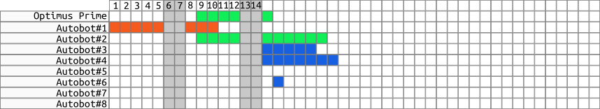

#   Time Table

This document provides general description and implementation details for
the `App.Views.TimeTables` application.

##  Description
The `App.Views.TimeTables` application should provide information regarding
team vacation requests. This information should be presented
as a time table of vacations.

The application should show members of selected team along with time table.

The application should provide HTML controls to select the following:
  - team, [**to be decided**]
  - view type.

The application should provide HTML control to render vacations time table
for members of selected team in a manner and style that are determined
by a view type.

The following view types should be supported:
  - by day, see *Figure 1*
  - by week,
  - by month.

*Figure 1. View by day*

##  Implementation
The application should be implemented as `App.Views.TimeTables`,
a view to represent *time tables of vacations*
provided by following views:
  - `App.Views.TimeTableByDay`,
  - `App.Views.TimeTableByWeek`.

The application should render appropriate view from the list above
depending on selected view type.
The application should be used by its master view, the `App.Views.Dashboard`.
The master view should pass a list of team ids.
The application should render appropriate time table view for each team separately,
and all at once, to let the user to see vacations for all selected teams.

View type selection should be provided with an HTML select control with
the following options:
  - view by day,
  - view by week.

The application should set the default date range to control number of visible
data on time tables. To change default values, user should be able to specify date range.
The application should provide two HTML date picker controls to get date range
from user.
Date range should be one for all time tables.

### Prerequisites
The view requires template to represent the following:
  - HTML controls to provide ability to select the following:
    - *view type*
    - *begin date*
    - *end date*
  - Placeholder for appropriate *time table* views.

The view requires the following information:
  - *team IDs*, to create time table for each team represented by ID

### Implementation Proposal
The following should be implemented within Backbone application:
  - Add `App.Views.TimeTables`
  - Add `App.Views.TimeTableByDay`, to present time table by day
  - Add `App.Views.TimeTableByWeek`, to present time table by week

##  Questions
The following should be discussed:
  - Which period of time to be displayed by default?
    What about two months?
